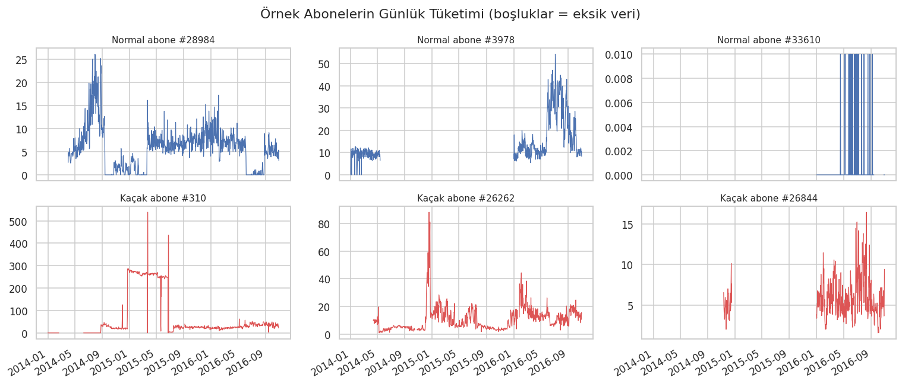
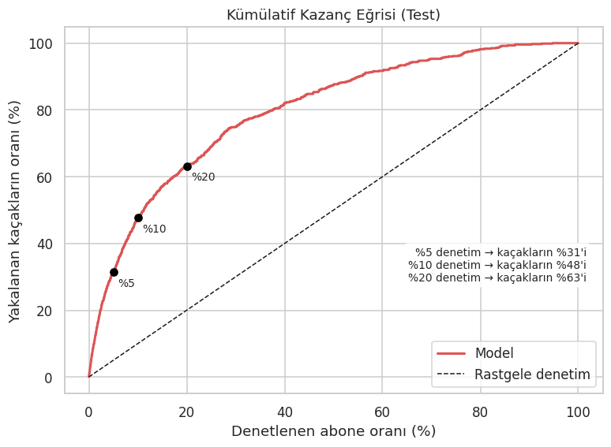
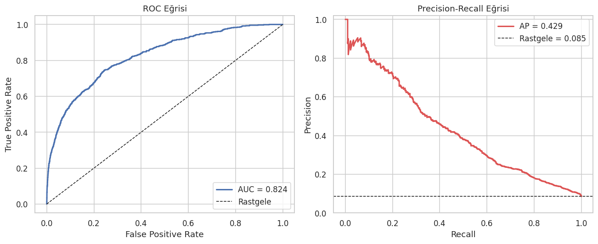
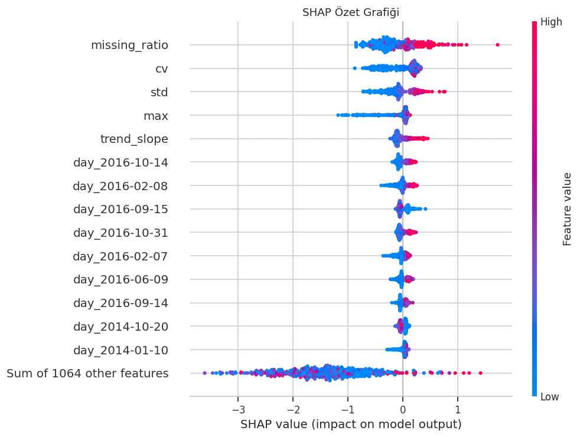
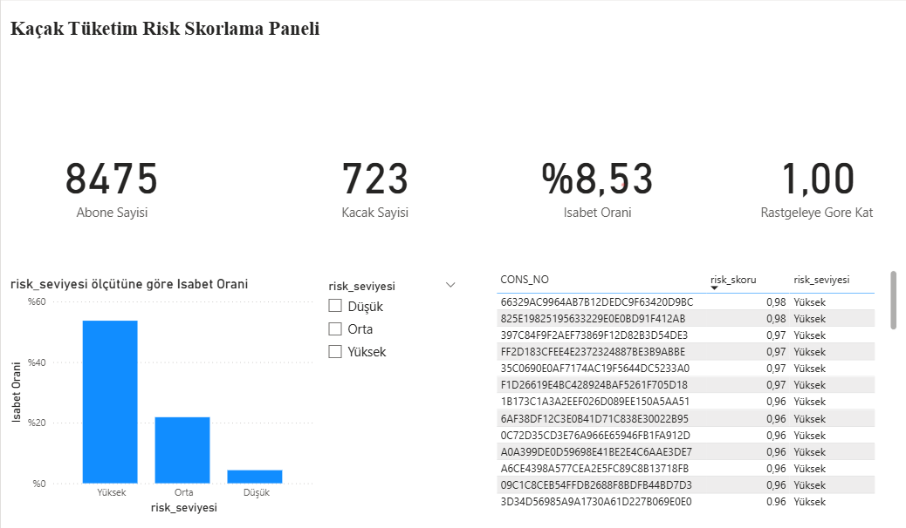

# Elektrik Kaçağı Tespiti | Electricity Theft Detection

[Türkçe](#türkçe) | [English](#english)

---

## Türkçe

Elektrik dağıtım şirketleri kaçak kullanımı bulmak için sahaya denetim ekipleri gönderir, ancak hangi adrese gidileceği çoğu zaman rastgele ya da tecrübeye dayalı seçilir. Bu projede abonelerin günlük tüketim verisinden her abone için bir **risk skoru** üreten bir model geliştirdim. Amaç, denetim ekiplerini kaçak olma ihtimali en yüksek adreslere yönlendirmek.

### Veri

[SGCC (State Grid Corporation of China)](https://www.kaggle.com/datasets/bensalem14/sgcc-dataset) veri seti: 42.372 abonenin Ocak 2014 ile Ekim 2016 arasındaki günlük elektrik tüketimi. Abonelerin %8.5'i kaçak olarak etiketli, yani veri oldukça dengesiz. Veride çok sayıda okunamayan gün ve sayaç hatası var.



Alt sol grafikteki kaçak abone tipik bir örnek: tüketimi bir gün aniden 280 kWh seviyesinden 25 kWh seviyesine düşüyor ve öyle kalıyor.

### Yaklaşım

- Eksik günleri her abonenin kendi zaman serisi içinde lineer interpolasyonla doldurdum. Sayaç hatası olan uç değerleri abone bazında sınırladım.
- Günlük tüketimin yanına yorumlanabilir özellikler ekledim: okunamayan gün oranı, tüketimdeki dalgalanma, trend, aylık ortalamalar, ani düşüş sayısı.
- Dengesiz veri için SMOTE ile XGBoost'un `scale_pos_weight` parametresini karşılaştırdım. `scale_pos_weight` her denemede daha iyi sonuç verdi.
- Model seçimini ve karar eşiğini ayrı bir validation setinde yaptım. Test setini yalnızca en sonda bir kez kullandım.
- Modelin kararlarını SHAP ile açıkladım.

### Sonuçlar

Test seti: 8.475 abone, 723 kaçak.

| Metrik | Model | Rastgele |
|---|---|---|
| ROC-AUC | 0.824 | 0.500 |
| PR-AUC | 0.429 | 0.085 |
| Precision | 0.403 | 0.085 |
| Recall | 0.479 | |

Model 723 kaçak abonenin yaklaşık 346'sını buluyor. Alarm verdiği her 100 adresten yaklaşık 40'ında gerçekten kaçak var. Aynı sayıda adres rastgele seçilseydi bu sayı 8 civarında olurdu.

Accuracy bu problemde yanıltıcı olduğu için ana metrik olarak kullanmadım. Herkese "normal" diyen bir model bile %91.5 accuracy alır ama hiçbir kaçağı bulamaz.

**Sahada ne anlama geliyor?** Aboneler risk skoruna göre sıralanıp en riskliler denetlendiğinde:

| Denetlenen abone | İsabet oranı | Rastgeleye göre | Yakalanan kaçak |
|---|---|---|---|
| En riskli %5 | %53.7 | 6.3 kat | %31 |
| En riskli %10 | %40.7 | 4.8 kat | %48 |
| En riskli %20 | %27.0 | 3.2 kat | %63 |





### Model neye bakıyor?



En etkili özellikler okunamayan gün oranı, tüketimdeki dalgalanma ve trend. Sayacı sık okunamayan, tüketimi düzensiz ve zamanla artan aboneler daha riskli görülüyor.

### Karar destek paneli (Power BI)

Modelin ürettiği risk skorlarını Power BI'da bir panele dönüştürdüm. Panel, saha ekibine gidecek en riskli 50 abonenin listesini, risk seviyelerine göre isabet oranını ve rastgele denetime göre kaç kat daha verimli olunduğunu gösteriyor. Dilimleyiciden bir risk seviyesi seçildiğinde tüm göstergeler ona göre güncelleniyor.



Kullanılan DAX ölçüleri:

```
Isabet Orani = DIVIDE([Kacak Sayisi], [Abone Sayisi])
Rastgele Isabet = CALCULATE([Isabet Orani], ALL(risk_scores_test))
Rastgeleye Gore Kat = DIVIDE([Isabet Orani], [Rastgele Isabet])
```

`Rastgele Isabet` ölçüsü `ALL` ile filtreleri kaldırıp tüm test setinin kaçak oranını hesaplıyor. Böylece hangi risk seviyesi seçilirse seçilsin, rastgele denetimle doğrudan karşılaştırma yapılabiliyor.

### Referans çalışmadan farklar

Başlangıç noktam Kaggle'daki [bu çalışmaydı](https://www.kaggle.com/code/kaanfikirkoca/using-data-balancing-techniques-and-xgboost). Orada eksik değerler farklı aboneler arasında dolduruluyor ve ölçekleme test verisi dahil tüm veriye uygulanıyordu. Bu hataları düzelttim. Referans çalışma yaklaşık 0.65 precision ve recall raporluyor. Bu projedeki sonuçlar daha düşük ama sızıntı içermeyen bir değerlendirmeye dayanıyor.

### Sınırlamalar

- Etiketler geçmiş denetimlerden geliyor. Tespit edilmemiş kaçakçılar veride "normal" görünüyor olabilir.
- En güçlü sinyal okunamayan gün oranı. Bu sayaç müdahalesinin bir izi olabilir, ama okunamayan sayaçların daha sık denetlenmesinden de kaynaklanıyor olabilir.
- Aylarca süren veri boşlukları interpolasyonla dolduruldu. Bu kısa boşluklar için makul, uzun boşluklar için yapay bir tahmin.
- Veri tek bir bölgeye ve döneme ait.

### Çalıştırma

```bash
pip install -r requirements.txt
```

Ardından `electricity_theft_detection.ipynb` dosyasını Jupyter veya Google Colab'de açın. Veri seti notebook içinde `kagglehub` ile otomatik indirilir. Tüm hücrelerin çalışması CPU'da yaklaşık 15 ile 20 dakika sürer.

Power BI paneli için `risk_scoring_dashboard.pbix` dosyasını Power BI Desktop ile açın. Panel, notebook'un ürettiği `risk_scores_test.csv` dosyasını kullanır.

---

## English

Electricity distribution companies send inspection teams into the field to find theft, but the addresses they visit are often chosen randomly or by experience. In this project I built a model that produces a **risk score** for every customer based on their daily consumption. The goal is to send inspection teams to the addresses most likely to involve theft.

### Data

The [SGCC (State Grid Corporation of China)](https://www.kaggle.com/datasets/bensalem14/sgcc-dataset) dataset: daily electricity consumption of 42,372 customers from January 2014 to October 2016. 8.5% of customers are labeled as theft, so the data is highly imbalanced. It also contains many unread days and meter errors.


The theft customer in the bottom left is a typical case: consumption suddenly drops from around 280 kWh to 25 kWh and stays there.

### Approach

- Filled missing days with linear interpolation along each customer's own time series, and capped meter error outliers per customer.
- Added interpretable features next to the raw daily values: share of unread days, consumption variability, trend, monthly averages and number of sudden drops.
- Compared SMOTE with XGBoost's `scale_pos_weight` for the class imbalance. `scale_pos_weight` won in every setup.
- Selected the model and decision threshold on a separate validation set. The test set was used only once, at the end.
- Explained the model's decisions with SHAP.

### Results

Test set: 8,475 customers, 723 of them theft.

| Metric | Model | Random |
|---|---|---|
| ROC-AUC | 0.824 | 0.500 |
| PR-AUC | 0.429 | 0.085 |
| Precision | 0.403 | 0.085 |
| Recall | 0.479 | |

The model finds about 346 of the 723 theft cases. Out of every 100 addresses it flags, about 40 are actual theft. Picking the same number of addresses at random would give around 8.

Accuracy is misleading here, so I did not use it as a main metric. A model that labels everyone as "normal" scores 91.5% accuracy while finding no theft at all.

**What does this mean in the field?** If customers are ranked by risk score and the riskiest are inspected first:

| Customers inspected | Hit rate | vs. random | Theft caught |
|---|---|---|---|
| Top 5% | 53.7% | 6.3x | 31% |
| Top 10% | 40.7% | 4.8x | 48% |
| Top 20% | 27.0% | 3.2x | 63% |


### What drives the model?


The strongest signals are the share of unread days, consumption variability and trend. Customers whose meters are often unread, whose consumption is irregular and increasing over time are seen as riskier.

### Decision support dashboard (Power BI)

I turned the model's risk scores into a Power BI dashboard. It shows the top 50 riskiest customers as an inspection list for field teams, the hit rate by risk level, and how many times more efficient the inspections are compared to random selection. Selecting a risk level in the slicer updates every indicator.


DAX measures used:

```
Isabet Orani = DIVIDE([Kacak Sayisi], [Abone Sayisi])
Rastgele Isabet = CALCULATE([Isabet Orani], ALL(risk_scores_test))
Rastgeleye Gore Kat = DIVIDE([Isabet Orani], [Rastgele Isabet])
```

The `Rastgele Isabet` (random hit rate) measure removes all filters with `ALL` and computes the theft rate of the whole test set, so any selected risk level can be compared directly with random inspection.

### Differences from the reference work

My starting point was [this Kaggle notebook](https://www.kaggle.com/code/kaanfikirkoca/using-data-balancing-techniques-and-xgboost). It filled missing values across different customers and fit the scaler on the whole dataset, including the test data. I fixed these issues. The reference reports around 0.65 precision and recall. The results here are lower, but they come from an evaluation without data leakage.

### Limitations

- Labels come from past inspections. Undetected theft may appear as "normal" in the data.
- The strongest signal is the share of unread days. This may be a trace of meter tampering, but it could also reflect that unread meters get inspected more often.
- Gaps lasting several months were filled by interpolation. This is reasonable for short gaps but an artificial estimate for long ones.
- The data comes from a single region and time period.

### How to run

```bash
pip install -r requirements.txt
```

Then open `electricity_theft_detection.ipynb` in Jupyter or Google Colab. The dataset is downloaded automatically inside the notebook with `kagglehub`. Running all cells takes about 15 to 20 minutes on CPU.

To view the dashboard, open `risk_scoring_dashboard.pbix` in Power BI Desktop. It uses the `risk_scores_test.csv` file produced by the notebook.